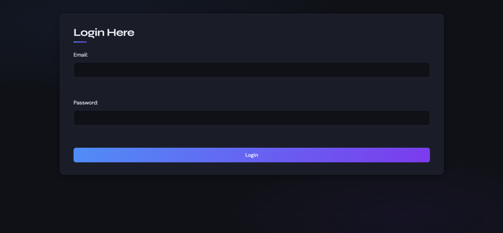
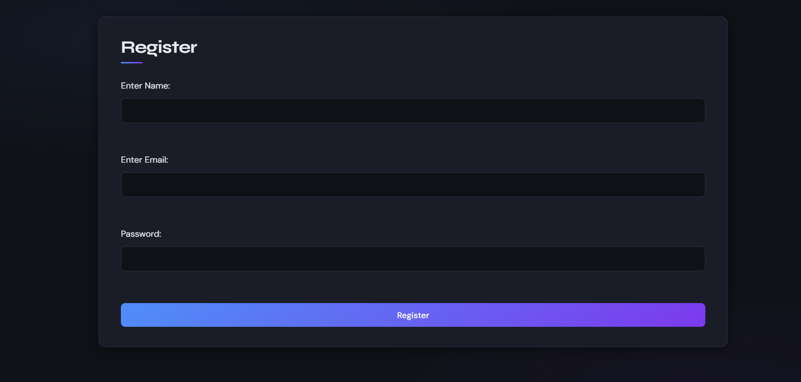
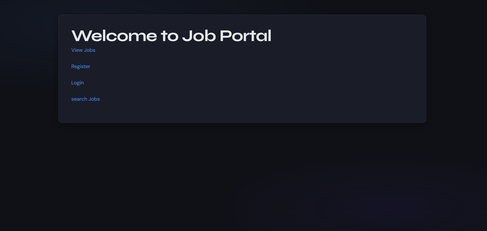
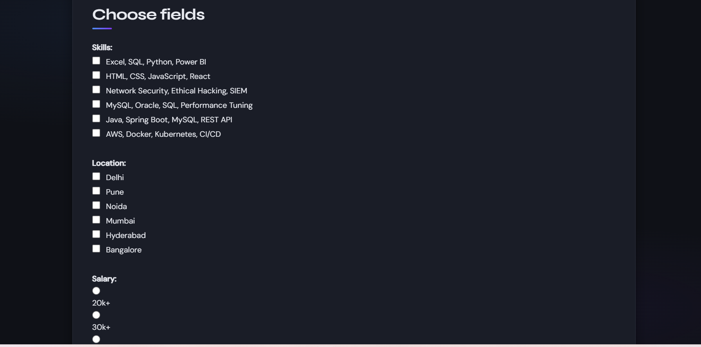
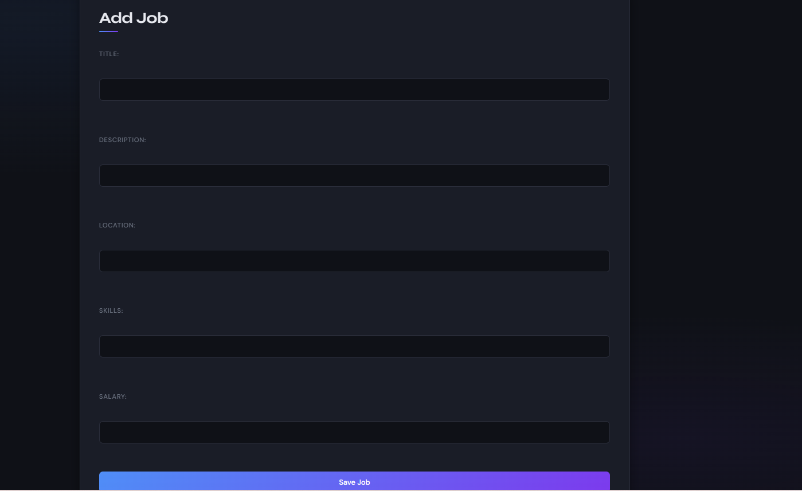

# 💼 Job Portal Application

A java bases Job Portal web application(👀Mainly Focused on Backend👀) built using **Spring Boot, Thymeleaf, Spring Data JPA, and MySQL**.  
It supports **role-based access** for Users, Recruiters, and Admins — enabling job browsing, applications, and job management.

---

## ✨ Features

🔐 **Authentication & Authorization**
- User Registration & Login (session-based)
- Role-based access control: **USER, RECRUITER, ADMIN**

🔎 **Job Browsing & Search**
- View all jobs with company, location, salary & skills
- Search & filter jobs by:
  - Skills 💻
  - Location 📍
  - Minimum Salary 💰

📄 **Job Application**
- Apply for jobs with:
  - Name & Email
  - Resume upload (PDF 📎)

🛠️ **Job Management**
- ➕ Post new jobs (Recruiter/Admin)
- ✏️ Edit jobs (Admin)
- ❌ Delete jobs (Admin)

🚪 **Session Management**
- Secure logout with session invalidation

---

## 🛠️ Tech Stack

- ☕ Java
- 🌱 Spring Boot
- 🍃 Spring Data JPA
- 🧩 Thymeleaf
- 🗄️ MySQL
- 🎨 HTML, CSS

---
## How to Run

1. Clone the repository
2. Configure `application.properties` with your MySQL credentials
3. Run the Spring Boot application
4. Open `http://localhost:8080` in your browser

## Screenshots

### Login

### Register

### Welcome

### Available Jobs

### Filter Jobs

### Add Job

   git clone https://github.com/sanju653/job-portal.git

